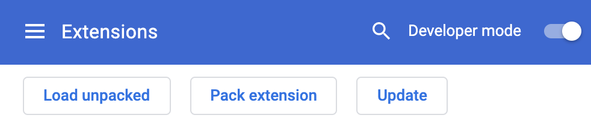

<p align="center">
  
</p>

<p>A chrome extension which allows you to monitor yourself to imporve your study efficiency and learn anything with your own cartoon partner. </p>

## How to start to use
Step 1: You can either download the zip file and uncompress it or run the following command in terminal:
```bash
git clone https://github.com/shawPLUSroot/fOoOcus.git
```

<p>Step 2: Please open your chrome browser. Next, go to chrome://extensions/ and enable Developer Mode by clicking the toggle switch next to Developer mode.</p>

<p>Step 3: Now your browser should be like the image below. Click the Load unpacked button and select the extension fOoOcus directory from where it was cloned to.</p>


## Inspiration
During the COVID-19 tough time, universities and schools have to choose to make classes change from in person into online, students across the world have to adapt it. However, many of them have trouble fitting themselves in time slots of classes, focusing on the contents that the educators tell and doing homework lonely. So we wanted to provide an application for students to imporve their efficiency and help them go through this tough period.

## What's next for fOoOcus
Face-api only supports six emotions, in this case, we cannot combine it with the feature of detecting if the user study efficiently and give positive feedback in time. Next, we would train more models to ensure the study partner can "talk" with the user according to their emotions for better learning. Besides, we want to manage a feature for note center, which would make the best advantage of online learning; You can easily select the text from pdf, html and mobi files and store it. Then we would alert you to review according to forgetting curve.

## LICENSE
<a href="LICENSE">
    
</a>